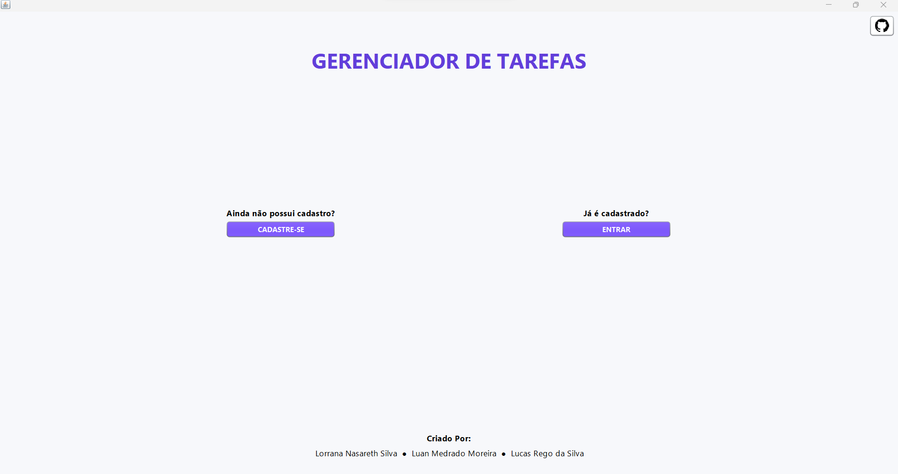
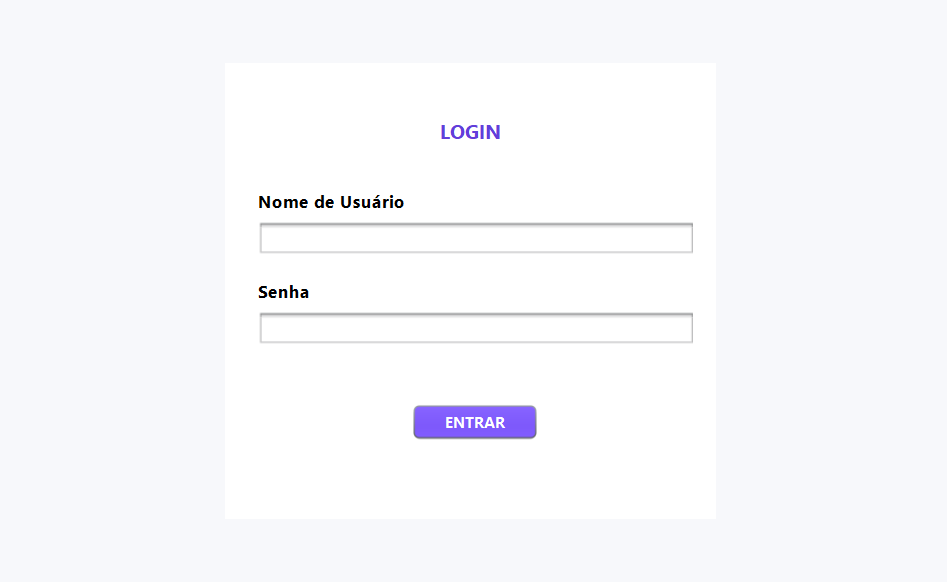
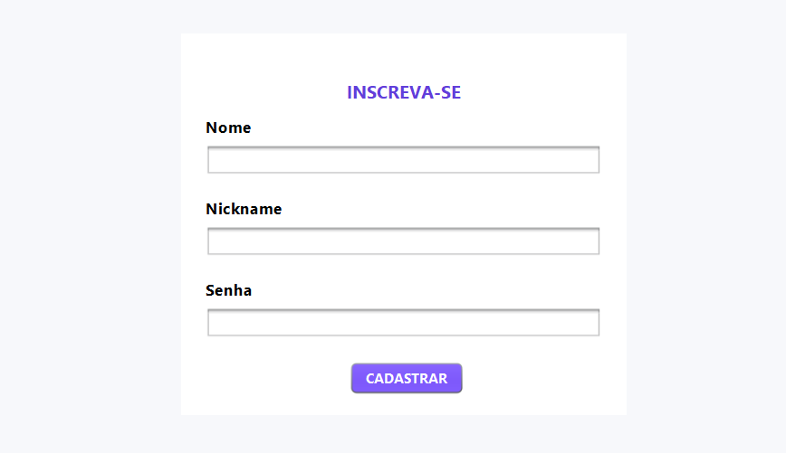
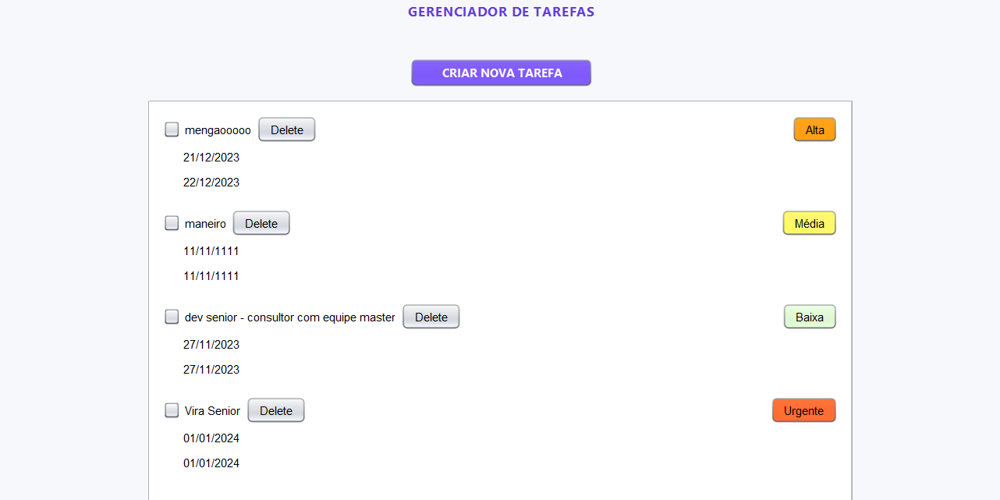
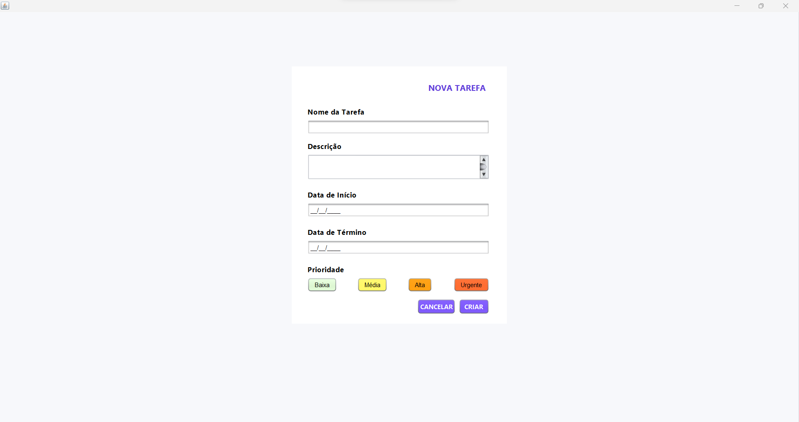

<h1 align="center">📝 Gerenciador de tarefas 📝</h1>

 

Projeto desenvolvido em java com integração PostgreSQL, versão web (PostgreSQL Elephant)  

  <a href="#-descrição">Descrição</a>&nbsp;&nbsp;&nbsp;|&nbsp;&nbsp;&nbsp;
  <a href="#-tecnologias">Tecnologias</a>&nbsp;&nbsp;&nbsp;|&nbsp;&nbsp;&nbsp;
  <a href="#-projeto">Projeto</a>&nbsp;&nbsp;&nbsp;|&nbsp;&nbsp;&nbsp;
  &nbsp;&nbsp;&nbsp;|&nbsp;&nbsp;&nbsp;

  

 

# 📝 Descrição

Este projeto consiste em um aplicativo de gerenciamento de tarefas desenvolvido em Java, utilizando a interface gráfica Swing e JOptionPane. O sistema oferece funcionalidades essenciais, como a criação e exclusão de tarefas, juntamente com telas de login e inscrição para controle de acesso.

- Integração Web com PostgreSQL: 
O gerenciador de tarefas possui uma integração eficiente com um banco de dados PostgreSQL, versão web (PostgreSQL Elephant). Esta integração permite que as informações sobre tarefas e usuários sejam armazenadas e recuperadas de forma persistente, garantindo consistência e disponibilidade dos dados.

## 🚀 Tecnologias

Esse projeto foi desenvolvido com as seguintes tecnologias:

- Java SWING e JDBC
- Maven
- PostgreSQL
- Git e Github

## 💻 Projeto
 

  
 

  
 

  
 

  
 

  
 

  
 

## 🫱🏽‍🫲🏾Colaboradores

- Colaboradores que fizeram parte do projeto.
  

     -  [@Lorrana Nasareth](https://github.com/LorranaNS)
      
     -  [@Luan Medrado](https://github.com/LuanMedrado8)
          
 
